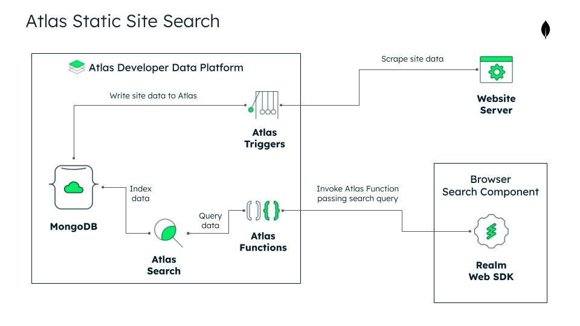

# MongoDB Atlas Static Site Search

This project is a website search engine and index that uses MongoDB Atlas
to perform search on static websites with a `sitemap.xml`.

Why use Atlas Static Site Search:

- Easy set up
- Free forever option
- Fully configurable
- Grows to web scale, powered by MongoDB Atlas
- No applying for use necessary (unlike [Algolia Docsearch](https://docsearch.algolia.com/))

## Add Atlas Static Site Search to your website

This section outlines how you can set up an instance of Atlas Static Site Search
and add it to your website.

### 1. Create an Atlas Project

Register for MongoDB Atlas (if you don't already have an account),
and create a new project.

Follow this guide to get started with Atlas - https://www.mongodb.com/docs/atlas/getting-started/

You can choose a free-tier cluster. Atlas Static Site Search works with it!

### 2. Clone this repository

Git-clone this repository to your computer. You need to clone it to set up
the configuration, which you'll do in the next couple of steps.

```sh
git clone https://github.com/mongodben/atlas-static-site-search.git
```

### 3. Create the Atlas Search index

Before you can create the search index,
you need to get the some data about your Atlas Project.
You must do this to call the Atlas Admin API to create the Atlas Search index
later in this step. Find your Atlas project `Group ID` and `Project Name`.

Navigating to the Project Settings in Atlas, where you can find the `Group ID`
and `Project Name`. For more information about Managing Atlas Project Settings,
refer to the [Manage Project Settings documentation](`Group ID` and `Project Name`).
Save this information for use later in this step.

Next, create a new Atlas Programmatic API Key for the Project following the
[Manage Programmatic Access to a Project documentation](https://www.mongodb.com/docs/atlas/configure-api-access/#manage-programmatic-access-to-a-project).
When setting the Project Permissions for the API Key,
select **Project Search Index Editor**. Copy down the `public key` and `private key`
for use later in this step.

By now you should have the following information ready for use:

- Group ID
- Project Name
- Public API key
- Private API key

Now run the following code in the terminal from the base directory of this repo:

```sh
GROUP_ID=<Atlas Group ID> \
CLUSTER_NAME=<Atlas Cluster Name> \
PUBLIC_KEY=<Project Public API Key> \
PRIVATE_KEY=<Project Private API Key> \
./scripts/create-atlas-search-index.sh atlas_search/site_index.json
```

### 4. Configure App Services

You're going to configure an Atlas App Services App that
Atlas Static Site Search uses to index site data and query Atlas Search.

First, download and configure the Realm CLI following this guide: https://www.mongodb.com/docs/atlas/app-services/cli/#installation

Add the full link to your website's `sitemap.xml` file to `app-services/values/SITEMAP_URL.json`. It should look like:

```json
{
  "name": "SITEMAP_URL",
  "value": "https://www.mongodb.com/docs/realm/sitemap.xml",
  "from_secret": false
}
```

Create a new App Services App that you'll deploy the config in the `app-serivces`
directory of this repo to. Do this by follwoing this guide: https://www.mongodb.com/docs/atlas/app-services/manage-apps/create/create-with-ui/

Copy the **App ID**, and add it to the the file `app-services/realm_config.json`
in the field `"app_id"`. Update any other config in `realm_config.json` as necessary.
For more information on updating `realm_config.json`, refer to the App configuration
reference - https://www.mongodb.com/docs/atlas/app-services/manage-apps/configure/config/app/

Once you're done, `realm_config.json` should look like:

```json
{
  "app_id": "docs-search-cxodi",
  "config_version": 20210101,
  "name": "docs-search",
  "location": "US-VA",
  "provider_region": "aws-us-east-1",
  "deployment_model": "LOCAL"
}
```

### 5. Deploy App Services

You're now ready to deploy the App to App Services.

Open your terminal, and enter the `app-services` directory.

Run the following command:

```sh
realm-cli push
```

Now you have successfully set up the Atlas Static Site Search backend.
The only thing left is to set up the client to query it from your website.

### 6. Add the React client to your website

**NOTE: The search client currently only works with React websites.**

In the project with the frontend of your website, add the npm package for the
[Atlas Static Site Search React component](https://github.com/joonyoungleeduke/atlas-static-site-search-box). Run in the terminal:

```sh
npm install atlas-static-site-search-box
```

Then add the `<Search />` component to your project,
passing your Atlas App Services App ID as a prop to `id`. For example:

```jsx
import Search from 'atlas-static-search-box';

<MyApp>
  <header>
    {/* other components in header */}
    <Search id="<Your App ID here" />
  </header>
</MyApp>
```

Now you're done!! You can now use the search component to query the search index
from the browser 🚀🚀🚀

## Architecture Overview

The project consists of a couple of different pieces to perform site search with
Atlas Search. These components are:

1. **Site scraper.** Use Atlas Triggers and an AWS Lambda function
   to scrape a website to create indexable data in database.
1. **Search index.** Uses Atlas Search and MongoDB to store and index data
   on Atlas.
1. **Search.** Use Atlas Functions to query Atlas Search.
1. **Frontend search component.** React component that you can plug into website
   to perform search. Uses Realm Web SDK to invoke site search Atlas Functions.



## Development Guide

Currently this project just exists within one Atlas project. There is only 1 version
of the project as of now. So any changes you deploy will go right to 'prod' of this
prototype.

The configuration of the App Services App exists in the `app-services` directory
of this repository. All changes should be made there, and then deploy using the
[Realm Github integration](https://www.mongodb.com/docs/atlas/app-services/manage-apps/deploy/automated/deploy-automatically-with-github/).

Edit the Atlas Search index in the `atlas_search/site_index.json` file.
On merge of your code, the index deploys to Atlas with the Github Action
`github-action-search-index.yml`.

Frontend search client code exists within the `frontend` directory.
The repo is configured to use Netlify for deploy previews.
Contact Ben Perlmutter (@mongodben) for changes to Netlify.

The AWS Lambda function used to help create the search index page data
is located in the `skunkworks-atlas-docs-search` directory. It uses the
[Serverless Framework](https://www.serverless.com/framework/docs/providers/aws/guide/intro). Deployment currently must be done manually by Nick Larew (@nlarew).

## Post-Prototype Roadmap

This'll be built out once the prototype phase advances.

- [ ] Improve the frontend UI. Visual tweaks and mobile optimize.
- [ ] Make the frontend component work with non-React-based websites.
- [ ] Streamline deployment.
- [ ] Add more configuration options.
- [ ] Create development/testing environments, and CI/CD to move between environments.
